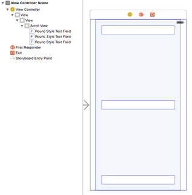
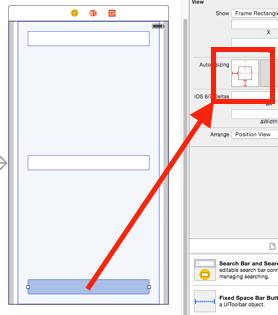
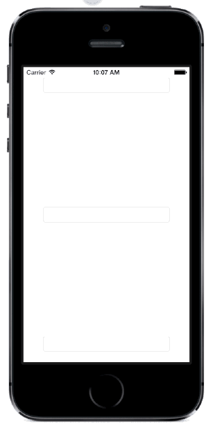

# TXViewKeyboardResizer

[](http://cocoapods.org/pods/TXViewKeyboardResizer)
[](http://cocoapods.org/pods/TXViewKeyboardResizer)
[](http://cocoapods.org/pods/TXViewKeyboardResizer)

It automatically resizes you UIView when keyboard appears.

It can be used with any kind of UIViews. 

If your view extends a UIScrollView, you need to adjust your UIScrollView.contentSize.

## Usage

First, choose the UIView that is going to be resized when keyboards appears.



Then, you need to check your Autolayout configuration or Autoresize values.

Here, i am going to use Autoresize as it is a little bit easier in that case.



With autoresize configured, when UIView resizes, our UITextField is positioned automaticaly.

Now we can call startKeyboardResizerObserver(WithDelegate:) inside our UIViewController:

```
- (void)viewDidLoad
{
  [super viewDidLoad];
  
  [self.scrollView startKeyboardResizerObserverWithDelegate:self];
}
```
We must remember stop observing when we are done with keyboard:

```
- (void)viewWillDisappear:(BOOL)animated
{
  [super viewWillDisappear:animated];
  
  [self.scrollView stopKeyboardResizerObserver];
}
```

## Delegate

And then, you can adjust your view per need:

```
- (void)viewWillResize:(UIView *)view;
- (void)viewDidResize:(UIView *)view;
- (void)viewDidTap:(UIView *)view;
```

We can close the keyboard, for example:

```
- (void)viewDidTap:(UIView *)view
{
  for (UIView *subview in self.scrollView.subviews)
  {
    if ([subview isMemberOfClass:[UITextField class]])
      [((UITextField *)subview) resignFirstResponder];
  }
}
```




## Requirements

iOS 6.+

## Installation

TXViewKeyboardResizer is available through [CocoaPods](http://cocoapods.org). To install
it, simply add the following line to your Podfile:

```ruby
pod "TXViewKeyboardResizer"
```

## License

TXViewKeyboardResizer is available under the MIT license. See the LICENSE file for more info.
